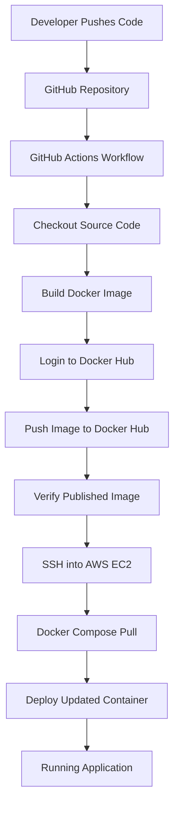

# DevOps CI/CD Pipeline with GitHub Actions, Docker, and AWS EC2

A hands-on DevOps project that automates Docker image building, publishing, and application deployment using GitHub Actions, Docker Hub, and an AWS EC2 instance.

## Overview

This project demonstrates a basic Continuous Integration and Continuous Deployment (CI/CD) pipeline. Whenever code is pushed to the `main` branch, GitHub Actions builds a Docker image, publishes it to Docker Hub, and deploys the updated application to an EC2 instance over SSH.

## Architecture



## Technologies Used

| Technology     | Purpose                                       |
| -------------- | --------------------------------------------- |
| Git & GitHub   | Version control and source code management    |
| GitHub Actions | CI/CD automation                              |
| Docker         | Application containerization                  |
| Docker Hub     | Docker image registry                         |
| AWS EC2        | Application hosting                           |
| SSH            | Secure remote server access                   |
| Docker Compose | Container deployment and lifecycle management |
| YAML           | CI/CD workflow and Compose configuration      |

## Project Structure

```text
devops-pipeline/
├── .github/
│   └── workflows/
│       └── dev-deployment.yaml
├── Dockerfile
├── index.html
├── docker-compose.yml
└── README.md
```

## CI/CD Workflow

The GitHub Actions workflow contains two jobs.

### 1. Build Job

Triggered by a push to `main` or manually through `workflow_dispatch`.

The job performs the following steps:

1. Checks out the repository source code.
2. Sets up Docker Buildx.
3. Authenticates with Docker Hub using GitHub Actions secrets and variables.
4. Builds the Docker image from the repository's `Dockerfile`.
5. Pushes two image tags to Docker Hub:

   * `latest`
   * The full Git commit SHA for version-specific deployments.
6. Pulls the published image and verifies it using Docker image inspection.

**Docker image repository:** `noransalm/devops-pipeline-lab`

### 2. Deploy Job

The deployment job runs only after the build job succeeds.

It performs the following steps:

1. Configures SSH access using a private key stored in GitHub Secrets.
2. Connects to the AWS EC2 instance.
3. Navigates to `/home/ubuntu/web-app`.
4. Pulls the image corresponding to the deployed commit.
5. Starts or updates the application using Docker Compose.
6. Checks the running container status.

Using a commit-specific image tag helps ensure that the deployed version matches the version built by the pipeline.

## Prerequisites

Before running the pipeline, make sure you have:

* A GitHub repository containing the application source code and a valid `Dockerfile`.
* A Docker Hub account and the `devops-pipeline-lab` image repository.
* An AWS EC2 instance running Ubuntu.
* Docker Engine and the Docker Compose plugin installed on EC2.
* SSH access to the instance using the correct private key.
* A Compose file on EC2 that references the Docker Hub image and uses the `IMAGE_TAG` environment variable.
* Appropriate EC2 security group rules for SSH and the application's required network port.

## Configuration

### GitHub Actions Secrets

Open your repository and navigate to:

**Settings → Secrets and variables → Actions → Secrets**

Configure the following secret:

| Secret            | Description                                            |
| ----------------- | ------------------------------------------------------ |
| `SSH_KEY`         | Private SSH key used to connect to the EC2 instance    |
| `DOCKERHUB_TOKEN` | Docker Hub access token with permission to push images |

Never commit private keys or access tokens to the repository.

### GitHub Actions Variables

Navigate to:

**Settings → Secrets and variables → Actions → Variables**

Add these repository variables:

| Variable             | Example or description                              |
| -------------------- | --------------------------------------------------- |
| `DOCKERHUB_USERNAME` | `noransalm`                                         |
| `EC2_HOST`           | Public IPv4 address or DNS name of the EC2 instance |
| `EC2_USER`           | `ubuntu` for a typical Ubuntu EC2 image             |

The workflow uses `vars` for repository variables and `secrets` for sensitive credentials.

## EC2 Deployment Configuration

The remote Compose file can use the following configuration for a web application that listens on port 80:

```yaml
services:
  web:
    image: noransalm/devops-pipeline-lab:${IMAGE_TAG:-latest}
    container_name: devops-pipeline-app
    ports:
      - "80:80"
```

Save it as `/home/ubuntu/web-app/docker-compose.yml` on the EC2 instance.

The application port mapping should match the port exposed by the container. If the Docker Hub repository is private, the EC2 instance must authenticate to Docker Hub before pulling the image.

## Running the Pipeline

### 1. Clone the Repository

```bash
git clone https://github.com/noran-salm/devops-pipeline.git
cd devops-pipeline
```

### 2. Build the Docker Image Locally

```bash
docker build -t noransalm/devops-pipeline-lab:latest .
```

### 3. Test the Container Locally

```bash
docker run --rm -p 8080:80 noransalm/devops-pipeline-lab:latest
```

Open `http://localhost:8080` if the application serves HTTP on container port 80.

### 4. Push Changes to GitHub

```bash
git add .
git commit -m "Update application"
git push origin main
```

### 5. Monitor the Workflow

1. Open the GitHub repository.
2. Select the **Actions** tab.
3. Open the latest workflow run.
4. Review the build, image publishing, verification, and deployment steps.

A workflow can also be started manually using the **Run workflow** option if `workflow_dispatch` is configured.

## Verification

### Verify the Docker Image

```bash
docker pull noransalm/devops-pipeline-lab:latest
docker image inspect noransalm/devops-pipeline-lab:latest
```

### Verify the Deployment on EC2

Connect to the EC2 instance and run:

```bash
cd /home/ubuntu/web-app
docker compose ps
docker compose logs --tail=100
```

To inspect the application from a browser, open the EC2 public address using the configured application port, provided the security group permits access.

## Security Considerations

* Store credentials and SSH private keys in GitHub Secrets.
* Use a Docker Hub access token rather than a personal password.
* Restrict SSH access to trusted IP addresses whenever practical.
* Expose only the network ports required by the application.
* Avoid disabling SSH host-key verification in automated deployments; verify and trust the EC2 host key securely.
* Use immutable, commit-specific image tags to make deployments traceable and repeatable.
* Remember that membership in the Linux `docker` group grants highly privileged access to the host.

## Troubleshooting

| Error                            | What to check                                                                                   |
| -------------------------------- | ----------------------------------------------------------------------------------------------- |
| Docker Hub login timeout         | Check connectivity to Docker Hub and retry the workflow.                                        |
| `insufficient_scope`             | Verify the Docker Hub username, repository name, token permissions, and image tag.              |
| `error in libcrypto`             | Verify the private key format and ensure the `SSH_KEY` secret contains the complete key.        |
| `Permission denied (publickey)`  | Confirm the EC2 key pair, SSH username, and matching private key.                               |
| `docker: command not found`      | Install Docker on EC2 and verify that it is available to the SSH user.                          |
| `no configuration file provided` | Ensure `compose.yaml` or another supported Compose filename exists in the deployment directory. |
| Image pull fails                 | Check the image name, tag, repository visibility, and Docker Hub authentication.                |
| Application is unreachable       | Check container logs, port mappings, application listening port, and EC2 security group rules.  |

## Future Improvements

* Add automated unit tests and linting before building the image.
* Scan Docker images for known vulnerabilities.
* Use AWS Systems Manager or another controlled deployment mechanism where appropriate.
* Provision infrastructure with Terraform.
* Add application health checks and rollback handling.
* Add monitoring and alerting using CloudWatch or Prometheus and Grafana.

## Learning Outcomes

Through this project, I practiced:

* Building automated CI/CD workflows with GitHub Actions.
* Building and publishing Docker images.
* Managing CI/CD credentials with GitHub Secrets and Variables.
* Connecting to an AWS EC2 instance through SSH.
* Deploying containers with Docker Compose.
* Troubleshooting pipeline failures involving authentication, networking, and deployment configuration.

## Author

**Noran Salm**

* GitHub: [noran-salm](https://github.com/noran-salm)
* Repository: [devops-pipeline](https://github.com/noran-salm/devops-pipeline)
